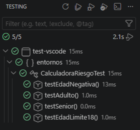
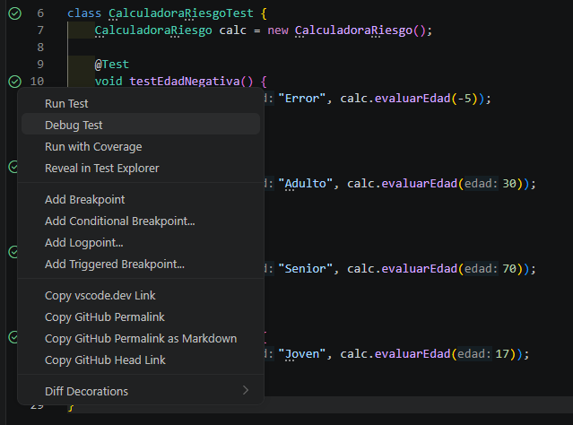
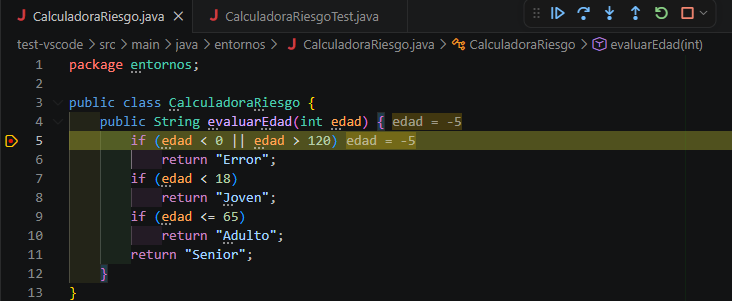
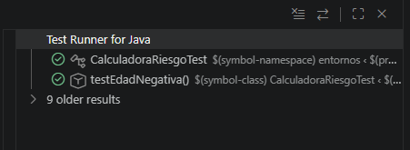

# 🧪 Práctica: Pruebas Unitarias con JUnit 5 en VS Code

## 📝 Descripción
Este proyecto consiste en la configuración y ejecución de pruebas unitarias en un entorno **Java** utilizando **Visual Studio Code** y **Maven**. El objetivo principal es validar la lógica de una clase `CalculadoraRiesgo` mediante el framework **JUnit 5**, explorando las herramientas de testeo y depuración que ofrece el IDE.

---

## 🛠️ Tecnologías Utilizadas

| Herramienta | Uso |
| :--- | :--- |
| **Java SDK** | Lenguaje de programación base. |
| **Maven** | Gestión de dependencias y ciclo de vida del proyecto. |
| **JUnit 5** | Framework para la creación de tests unitarios. |
| **VS Code** | IDE de desarrollo con extensiones de Java. |

---

## 🚀 Desarrollo de la Práctica

### 1. Configuración del Proyecto
Se ha generado la estructura del proyecto utilizando el asistente de VS Code con el arquetipo `maven-archetype-quickstart`. La configuración de dependencias se gestionó en el archivo `pom.xml` para asegurar la compatibilidad con JUnit 5.

### 2. Lógica de Negocio (`CalculadoraRiesgo.java`)
Se implementó un método `evaluarEdad(int edad)` que clasifica a los usuarios según su rango de edad:
* `< 0` o `> 120`: **Error**
* `< 18`: **Joven**
* `18 - 65`: **Adulto**
* `> 65`: **Senior**

### 3. Pruebas Unitarias (`CalculadoraRiesgoTest.java`)
Se diseñaron diversos casos de prueba para cubrir los límites de la lógica, incluyendo los retos propuestos:
* `testEdadNegativa()`
* `testAdulto()`
* `testSenior()` (Añadido)
* `testEdadLimite18()` (Añadido)

---

## 📸 Evidencias de Ejecución

A continuación se muestran las capturas de pantalla que demuestran el correcto funcionamiento del entorno:

### A. Testing Explorer (El Matraz)
Ejecución completa de la suite de pruebas desde el panel lateral de VS Code, mostrando todos los tests en verde (pass).

### B. Codelens e Interfaz de Usuario
Uso de los accesos directos `Run | Debug` sobre el código fuente y menú contextual para la gestión individual de tests.

### C. Depuración (Debugging)
Demostración del uso de **Breakpoints** para la inspección de variables en tiempo de ejecución. En la imagen se observa el seguimiento del valor `edad = -5`.

### D. Test Runner for Java
Resumen de resultados históricos y ejecución detallada mediante la extensión de Java.

---

## 🎓 Conclusiones
La práctica permite entender que no es estrictamente necesario un IDE pesado como IntelliJ para trabajar con Java de forma profesional. **VS Code**, junto con **Maven**, ofrece un flujo de trabajo ligero y potente para el desarrollo guiado por pruebas (TDD).

---
**Autor:** Alberto Larios Espina
**Repositorio:** [littledumbduck/entornos](https://github.com/littledumbduck/entornos/)
